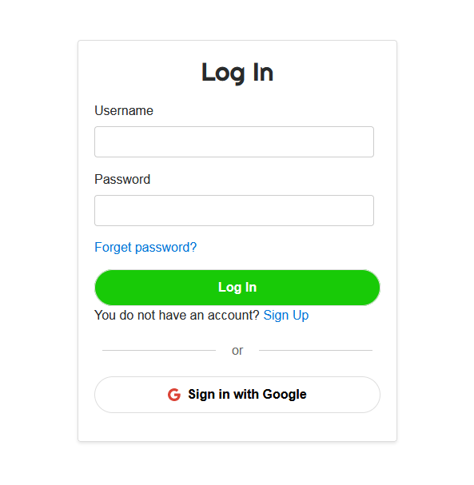
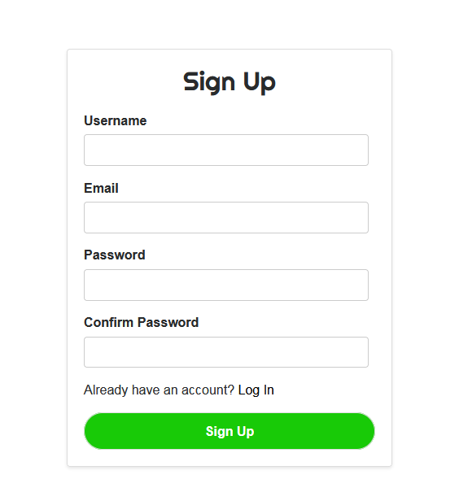
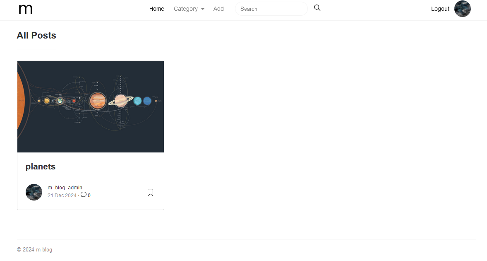
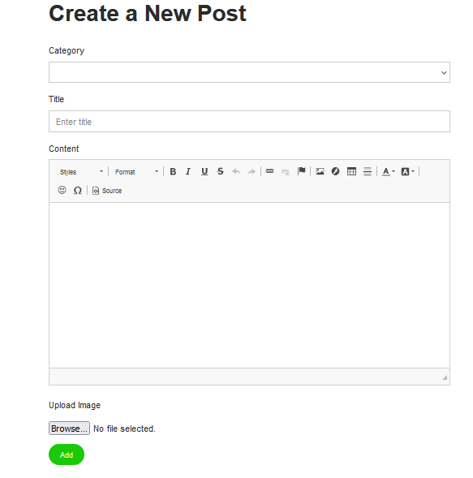
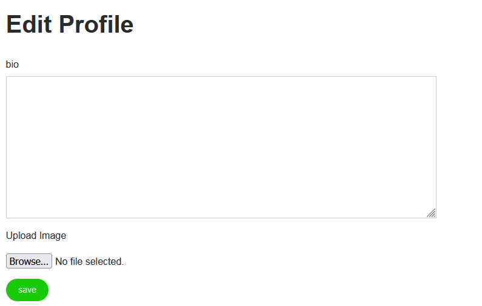

# Django m-blog :
this is a django blog website where you can add and delete your post easily and make it beautiful as you like .

# Featurs :
- user authentication(signup, login, logout, reset password)
- profile managment(edit boi, change thumbnail)
- add post(title, text, image, category)
- delete post
- add comment
- delete comment
- add to favourite 
- remove from favourite
- favourite list
- search for post title or author

# Installation :

1.Clone the repository:
```
	https://github.com/KhadijaAbdeLouassaa/m-blog.git
```
2.Create virtual environment:
```
	pip install virtualenv
	virtualenv env
```
3.Activate virtual environment:
```
	env\scripts\activate
```
4.Install requirements:
```
	pip install -r requirements.txt
```
5.Migrate Database:
```
	py manage.py makemigrations
	py manage.py migrate
```
6.Runing server:
```
	py manage.py runserver
```
### Login page :

### Signup page :

### Home page :

### Create post page :

### Edit profile page :

